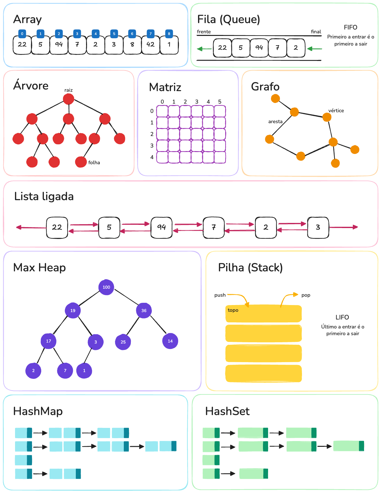
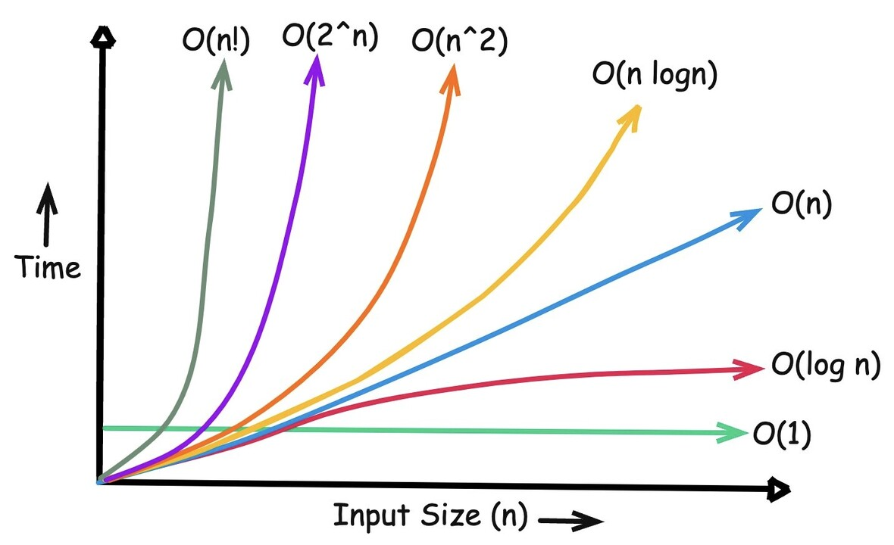

# Estrutura de Dados e Algoritmos

Linguagens e frameworks abstraem a implementação, mas **não resolvem problemas de eficiência, memória ou complexidade**. Sem entender estruturas de dados e algoritmos, você vai depender de soluções prontas sem saber quando são inadequadas, criando código lento ou impossível de escalar. Frameworks mudam; lógica de dados e processamento é atemporal. Aprender isso é investir em **capacidade de raciocínio e autonomia**, não em tecnologia específica.

Este repositório reúne, implementa e documenta minha trajetória em um estudo aprofundado sobre as diversas estruturas de dados e os algoritmos que as manipulam.

## Estruturas de dados

Estrutura de dados é a forma como a informação é organizada e armazenada na memória do computador para ser utilizada de maneira eficiente. Ela define **como os dados são dispostos** (contíguos ou não, hierárquicos ou lineares), **como podem ser acessados** (sequencial, direto, por chave, por ponteiro) e **quais operações** podem ser realizadas sobre eles (inserção, remoção, busca, atualização).

## Algoritmos

Um algoritmo é um conjunto de instruções **precisas e finitas** que define **como resolver um problema ou executar uma tarefa**. Ele estabelece a **sequência exata de operações** a serem realizadas para chegar a um resultado.

A eficiência de um algoritmo depende diretamente da estrutura de dados usada: um mesmo algoritmo pode ser rápido ou lento, consumir pouca ou muita memória, dependendo de como os dados estão organizados. Sem entender estruturas de dados, você não consegue criar algoritmos eficientes nem avaliar trade-offs de desempenho.

## Conceitos introdutórios

Na computação, a unidade básica de informação é o **bit**, cujo valor compreende uma entre duas possibilidades mutuamente exclusivas. A ideia é análoga a um interruptor que pode estar ligado ou desligado. Abaixo estará esse e alguns outros conceitos introdutórios que serão necessários para o entendimento dos tópicos abordados no repositório.

- [Bit](src/intro-concepts/bit-and-byte/bit.md) ou [Byte](src/intro-concepts//bit-and-byte/byte.md)?
- [Inteiros binários e decimais](src/intro-concepts/data-types/binary-and-decimal-integer.md)
- [Números reais](src/intro-concepts/data-types/floating-numbers.md)
- [Strings e caracteres](src/intro-concepts/data-types/strings-and-chars.md)
- [Hardware e software](src/intro-concepts/hardware-and-software/hardware-and-software.md)
- [Ponteiros](src/intro-concepts/pointers/pointers.md)

### Notação O - Big O Notation

A notação Grande O é usada para descrever o comportamento de um algoritmo em termos de seu crescimento. Ela é usada para descrever o pior caso de desempenho de um algoritmo.

| Estrutura de dados      | Acesso     | Busca     | Inserção  | Remoção   |
| ----------------------- | ---------- | --------- | --------- | --------- |
| Array                   | O(1)       | O(n)      | O(n)      | O(n)      |
| Lista encadeada         | O(n)       | O(n)      | O(1)      | O(1)      |
| Pilha                   | O(n)       | O(n)      | O(1)      | O(1)      |
| Fila                    | O(n)       | O(n)      | O(1)      | O(1)      |
| Tabela Hash             | -          | O(n)      | O(n)      | O(n)      |
| Árvore de busca binária | O(n)       | O(n)      | O(n)      | O(n)      |
| Árvore binária          | O(log (n)) | O(log(n)) | O(log(n)) | O(log(n)) |
| Árvore rubro-negra      | O(log (n)) | O(log(n)) | O(log(n)) | O(log(n)) |

Fonte: [Big O Cheat Sheet](https://www.bigocheatsheet.com/).

