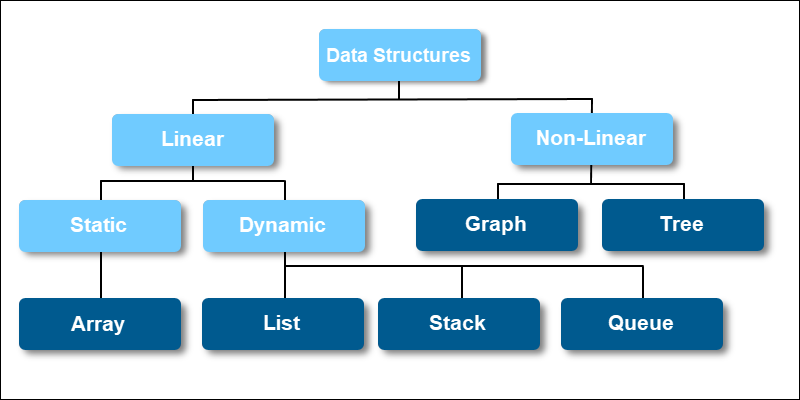

# Classificação das Estruturas de Dados

### Estrutura de dados linear

A estrutura de dados na qual os elementos de dados são organizados sequencialmente ou linearmente, onde cada elemento é anexado aos seus elementos adjacentes anteriores e posteriores, é chamada estrutura de dados linear.

> Exemplos de estruturas de dados lineares são _array_, _pilha_, _fila_, _lista encadeada_, etc.

- **Estrutura de dados estática**: A estrutura de dados estática tem um tamanho de memória fixo. É mais fácil acessar os elementos em uma estrutura de dados estática. Um exemplo dessa estrutura de dados é um _array_.
- **Estrutura de dados dinâmica**: Na estrutura de dados dinâmica, o tamanho não é fixo. Ele pode ser atualizado aleatoriamente durante o tempo de execução, o que pode ser considerado eficiente em relação à complexidade da memória (espaço) do código. Exemplos dessa estrutura de dados são _fila_, _pilha_, etc.

### Estrutura de dados não linear

As estruturas de dados em que os elementos de dados não são colocados sequencialmente ou linearmente são chamadas de estruturas de dados não lineares. Em um estrutura de dados não linear, não podemos percorrer todos os elementos em apenas uma única execução.

> Exemplos de estruturas de dados não lineares são _árvores_ e _grafos_.
