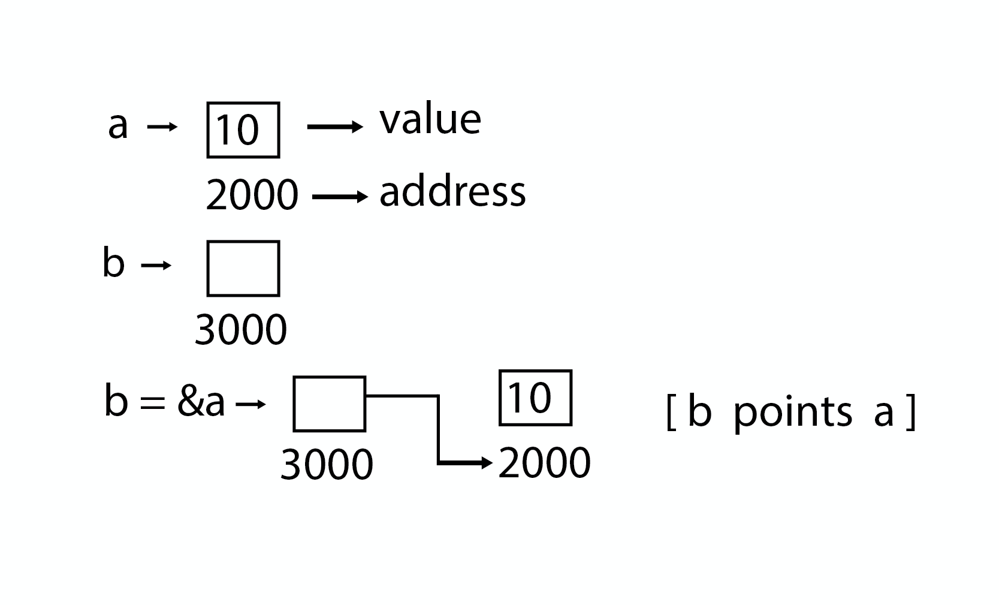

# Ponteiros

O ponteiro é usado para apontar o endereço do valor armazenado em qualquer lugar na memória do computador. Obter o valor armazenado no local é conhecido como **desreferenciar** o ponteiro. O ponteiro melhora o desempenho para processos repetitivos, como:

- Cadeia de Travessia
- Tabelas de Pesquisa
- Tabelas de Controle
- Estruturas de Árvore

## Detalhes do ponteiro

- **Aritmética do ponteiro**: Existem quatro operadores aritméticos que podem ser usados em ponteiros: _++_, _--_, _+_ e _-_.
- **Array de ponteiros**: Você pode definir arrays para conter um número de ponteiros.
- **Ponteiro para ponteiro**: C permite que você tenha um ponteiro em um ponteiro, e assim por diante.
- **Passasndo ponteiros para funções em C**: Passar um argumento por referência ou por endereço permite que o argumento passado seja alterado na função callback pela função chamada.
- **Ponteiro de retorno de função em C**: C permite que uma função retorne um ponteiro para a variável local, variável estática e memória alocada dinamicamente também.

[Veja o exemplo](../code/pointer.c)
