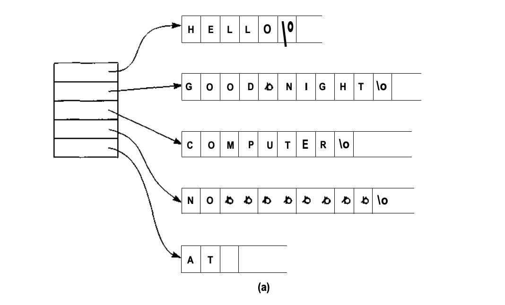
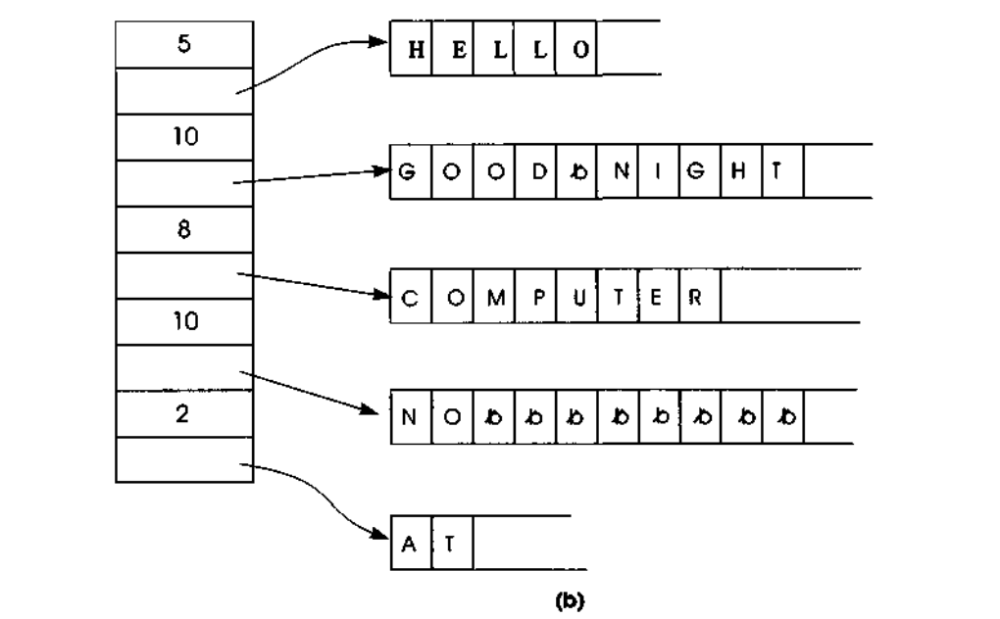

# Implementando Vetores Unidimensionais

Um vetor unidimensional pode ser facilmente implementado. A declaração C:

```C
int b[100];
```

Reserva 100 posições sucessivas de memória, cada um suficientemente grande para conter um único inteiro. O endereço da primeira dessas posições é chamado **_endereço base_** do vetor _b_ e é indicado por _base(b)_. Suponha que o tamanho de cada elemento individual do vetor seja _esize_. Então, uma referência ao elemento _b[0]_ é para o elemento na posição base(b), uma referencia para _b[1]_ é para o elemento em _base(b) + esize_, uma referencia para _b[2]_ é para o elemento em _base(b) + 2 \* esize_, e assim por diante. A referência para o elemento _b[i]_ é para o elemento em _base(b) + i \* esize_.

Na linguagem C uma variável vetor é implementada como uma variável de ponteiro. O tipo da variável _b_ na declaração anterior é "ponteiro para um inteiro" ou "_int \*_". **Não aparece um asterisco na declaração porque os colchetes indicam automaticamente que a variável é um ponteiro**. A diferença entre as declarações _int \*b_ e _int b[100]_; é que a última reserva também 100 posições de inteiros **começando na posição _b_**. Em C, o valor da variável _b_ é _base(b)_, e o valor da variável _b[i]_, onde _i_ é um inteiro, é \*(b + i). Na Seção 1 você verificou que, como _b_ é um ponteiro para um inteiro, _\*(b + i)_ é o valor do **iésimo** inteiro depois do inteiro na posição _b_. _b[i]_, o elemento na posição _base(b) + i \* esize_, é **equivalente** ao elemento apontado por _b + i_, ou seja, _\*(b + i)_.

> 💡 Em C, todos os elementos de um vetor têm **tamanho fixo**, predeterminado. Entretanto, algumas linguagens de programação permitem vetores de objetos de vários tamanhos. Por exemplo, uma linguagem poderia permitir vetores de strings de caracteres de tamanho variável. Nesses casos, o método anterior não pode ser usado para implementar o vetor. Isso acontece porque esse método de calcular o endereço de um elemento específico do vetor depende do conhecimento do tamanho fixado (_esize_) de cada elemento anterior. Se nem todos os elementos têm o mesmo tamanho, uma implementação diferente precisa ser usada.

Um método para implementar um vetor de elemento com **tamanho variável** é reservar um conjunto contíguo de posições de memória, cada uma das quais armazenando um endereço. O conteúdo de cada posição de memória é o endereço do elemento do vetor, de tamanho variável, em alguma outra parte da memória. Por exemplo a figura abaixo ilustra um vetor de cinco strings de caracteres de tamanho variável, sob as duas implementações de inteiros de tamanho variável. O caractere de índice '6' (\\0) é usado para indicar o final de cada string de caracteres, sendo ele um espaço em branco.



> 💡 Em C, uma string é, por si só, implementada como um vetor, de modo que um vetor de strings é, na verdade, um vetor de vetores - um vetor bidimensional.

Como o **tamanho de** cada **endereço** é fixo, a posição do endereço de determinado elemento pode ser calculada do mesmo modo que a posição de um elemento de tamanho fixo foi computada nos exemplos anteriores. Assim que essa posição for conhecida, seu conteúdo poderá ser usado para determinar a posição do verdadeiro elemento do vetor. Evidentemente, isso acrescenta um nível adicional de acesso indireto para referenciar um elemento do vetor, já que envolve uma referência extra de memória, o que, por sua vez, reduz a eficiência. Entretanto, é um preço baixo a pagar pela conveniência de manter um vetor como esse.

Um método semelhante para implementar o vetor de elementos de tamanho variável é manter todas as partes de tamanho fixo dos elementos na área contígua do vetor, além de manter o endereço da parte de tamanho variável na área contígua. Por exemplo, na implementação de strings de caracteres de tamanho variável, apresentada na seção anterior, cada string contém uma parte de tamanho fixo (um campo de um byte de tamanho) e uma parte de tamanho variável (a própria string de caracteres). Uma implementação de um vetor de strings de caracteres de tamanho variável mantém o tamanho da string junto com o endereço, conforme mostrado na figura abaixo:



A vantagem desse método é que as partes de tamanho fixo de um elemento podem ser examinadas sem uma referência extra de memória. Por exemplo, uma função para determinar o real tamanho de uma string de caracteres de tamanho variável pode ser implementada com um único acesso à memória. A informação do tamanho fixo para o elemento de tamanho variável de um vetor, armazenada na área de memória contígua, é frequentemente chamada de **_cabeçalho_**
