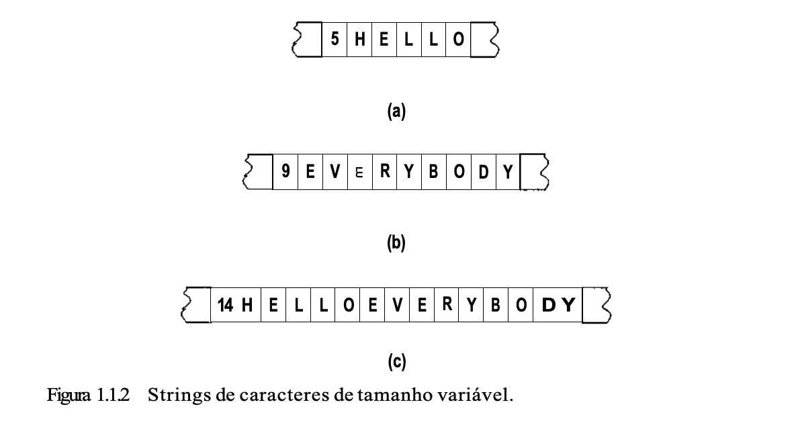
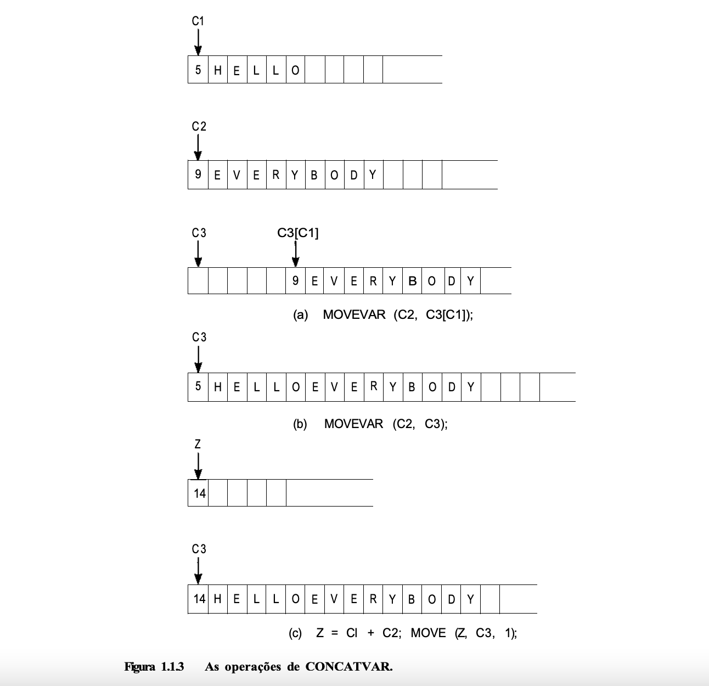

# Um Exemplo

Ilustraremos esses conceitos com um exemplo. Vamos supor que o hardware de um computador contenha uma instrução:

```
MOVE (origem, dest, compr)
```

que copia uma string de caracteres de bytes com o tamanho representado por _compr_ a partir de um endereço especificado por _origem_ para um endereço especificado por _dest_. (Apresentamos instruções do hardware com letras maiúsculas. O tamanho deve ser especificado por um inteiro e, por essa razão, nós o indicamos com letras minúsculas, _origem_ e _dest_ podem ser especificados por indentificadores que representam posições de armazenamento). Um exemplo dessa instrução é `MOVE(a,b,3)`, que copia os três bytes a partir da posição de armazenamento _a_ para a posição de armazenamento _b_.

> 💡 Observe os papéis distintos desempenhados pelos identificadores _a_ e _b_ nessa operação. O primeiro operando da instrução `MOVE` é o **conteúdo** da posição especificada pelo identificador _a_. O segundo operando, entretanto, não é o conteúdo da posição _b_, uma vez que esse conteúdo é irrelevante para a execução da instrução. Em substituição, a própria posição é o operando porque ela especifica o desitno da string de caracteres. Embora um identificador sempre represente uma posição, é comum o uso de um identificador como referência ao conteúdo dessa posição. Sempre ficará evidente pelo contexto se um identificador está referenciando uma posição (ponteiro) ou o seu conteúdo. O identificador que aparece como primeiro operando de uma instrução `MOVE` refere-se ao conteúdo na memória, enquanto o identificador que aparece como segundo operando indica uma posição.

## Iterando Endereços

Ocasionalmente, é necessário **acrescentar uma quantidade num endereço para obter outro endereço**. Por exemplo, se _a_ é uma posição na memória, é possível referenciar a posição quatro bytes à frente de _a_. Não podemos referir-nos a essa posição como a + 4, uma vez que essa notação é reservada ao conteúdo inteiro da posição a + 4. Sendo assim, introduzimos a notação a[4] como uma referência a essa posição. Apresentamos também a notação _a[x]_ para referenciar o endereço dado pela soma do conteúdo dos inteiros binários do byte em _x_ com o endereço _a_.

A instrução MOVE exige que o programador especifique o tamanho da string a ser copiada. Dessa forma, seu operador é uma string de caracteres de tamanho fixo (isto é, o tamanho da string deve ser conhecido).

Vamos supor que precisemos implementar string de caracteres de tamanhos variáveis nessa máquina. Ou seja, permitiremos que os programadores usem uma instrução:

```
MOVEVAR(origem, dest)
```

Para deslocar uma string de caracteres da poisção especificada por _origem_ para a posição representada por _dest_, sem precisar determinar qualquer tamanho.

Para implementar esse novo tipo de dado, devemos primeiro determinar como ele será representado na memória da máquina e, em seguida, indicar como essa representação será manipulada. Evidentemente, é necessário saber quantos bytes que deve ser deslocada para executar essa instrução. Como a operação MOVEVAR não especifica esse número, ele precisa estar contido dentro da representação da própria string de caracteres.
Uma string de caracteres de tamanho variável, com o tamanho _l_, pode ser representada por um conjunto **contíguo** de _l_ + 1 bytes (_l_ < 256). O primeiro byte contém a representação binária do tamanho _l_ e os bytes restantes contêm a representação dos caracteres na string.



Observe que os digitos 5 e 9 nessa figura não substituem os padrões de bits que representam os caracteres '5' e '9' (strings), mas os padrões 00000101 e 00001001 [presumindo um byte de 8 bits], que representam os inteiros cinco e nove.

O programa para implementar a operação MOVEVAR pode ser escrito como segue (_i_ é uma posição de memória auxiliar):

```
MOVE (origem, dest, l);
for (i = l; i < dest; i++)
    MOVE (origem[i], dest[i], l);
```

De maneira semelhante, podemos implementar uma operação CONCATVAR(c1, c2, c3) para concaternar duas strings de caracteres de tamanho variável nas posições c1 e c2, e colocar o resultado em c3.

```
/* move o comprimento */
z = c1 + c2;
MOVE(z, c3, l);
/* move a primeira string */
for (i = l; i <= c1; MOVE(c1[i], c3[i], l));
/* move a segunda string */
for (i = l; i <= c2) {
    x = c1 + i;
    MOVE(c2[i], c3[x], l);
}
```

Entretanto, uma vez que a operação de MOVEVAR esteja definida, CONCATVAR pode ser implementada, usando MOVEVAR, como segue:

```
MOVEVAR(c2, c3[c1]); /* move a segunda string */
MOVEVAR(c1, c3); /* move a primeira string */
z = c1 + c2; /* atualiza o tamanho do resultado */
MOVE(z, c3, l);
```



Observe que essa representação de strings de caracteres de tamanho variável permite somente strings cujo tamanho seja menor ou igual ao maior inteiro binário que caiba num único byte. Se um byte tem oito bits, isso significa que a maior string terá 255 (ou seja, 2<sup>2</sup>"<sup>1</sup>) caracteres. Para permitir strings mais extensas, deve-se escolher uma representação diferente e criar um novo conjunto de programas.

Se usarmos essa representação de strings de caracteres de tamanho variável, a operação de concatenação será inválida se a string resultante tiver mais de 255 caracteres. Como o resultado de uma operação como essa é indefinido, uma ampla variedade de ações pode ser implementada caso essa operação seja experimentada. Uma possibilidade é usar somente os 255 primeiros caracteres do resultado. Outra possibilidade é ignorar totalmente a operação e não deslocar nada para o campo do resultado. Existe também a opção de imprimir uma mensagem de advertência ou de pressupor que o usuário queira chegar a qualquer resultado que o implementador determinar.

Na verdade, a linguagem C usa uma implementação totalmente diferente entre strings e caracteres, que evita esta limitação sobre o tamanho da string. Em C, todas as strings terminam com um caractere especial, '\0'. Este caractere, que nunca aparece dentro de uma string, é automaticamente introduzido pelo compilador no final de cada string. Como o tamanho da string não é conhecido antecipadamente, todas as operações de strings devem proceder de um caractere por ver até que o caractere '\0' seja encontrado.

O programa para implementar a operação de MOVEVAR, sob esta implementação, pode ser escrito assim:

```
i = 0;
while (source[i] != '\0') {
    MOVE(source[i], dest[i], l)ç
    i++;
}
dest[i] = '\0';
/* encerra a string de destino com '\0' */
```

Para implementar a operação de concatenação, CONCATVAR(cl, c2, c3), podemos escrever:

```
i = 0;
/* move a primeira string */
while (c1[i] != '\0') {
    MOVE(c1[i], c3[i], l);
    i++;
}
/* move a segunda string */
j = 0;
while (c2[j] != '\0')
    MOVE(c2[j], c3[i++], l);
/* encerra a string de desitno com um '\0'  */
c3[i] = '\0';
```

Uma desvantagem da implementação de strings de caracteres de C é que o tamanho de uma string de caracteres não está prontamente disponível sem avançar na string um caractere por vez até encontrar um '\0'. Isto é mais do que compensado pela vantagem de não haver um limite arbitrário imposto sobre o tamanho da string.
