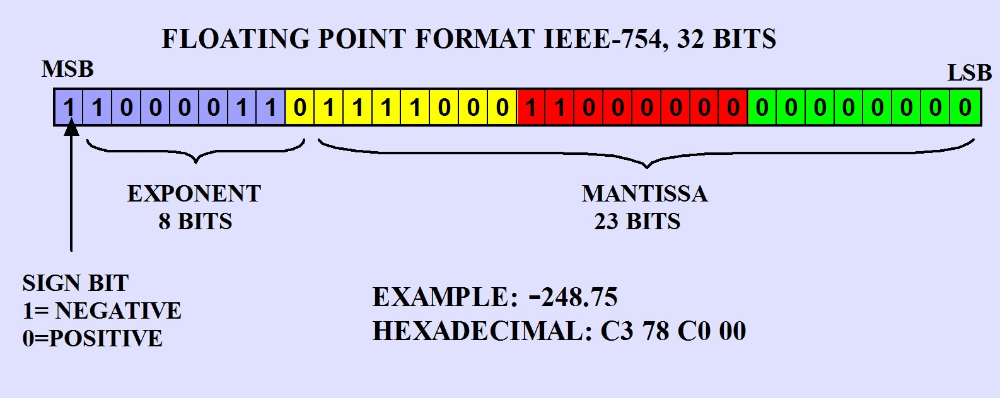

# Números reais

O método comum usado pelos computadores para representar números reais é a **notação de ponto flutuante**. Existem vários tipos de notação de ponto flutuante e cada uma tem características próprias, O conceito-chave é que um número real é representado por um número chamado **mantissa**, sendo uma **base** elevada a uma potência de inteiro chamada **expoente**. Em geral, a base é fixa, e a mantissa e o expoente variam de modo a representar números reais diferentes. Por exemplo, se a base for fixada com 10, o número 387,53 poderia ser representado como 38753 x 10-2. (Lembre-se de que 10-2 é 0,01). A mantissa é 38753 e o expoente é -2. Outras possíveis representações são 0,38753 x 103 e 387,53 x 100. Optamos pela representação na qual a mantissa é um inteiro sem 0s finais.

