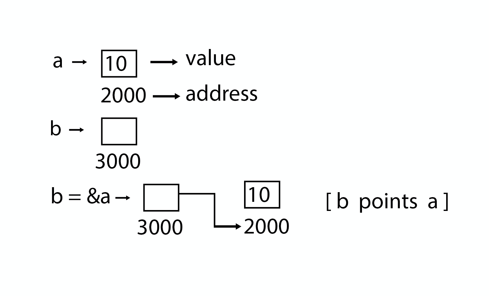

# Ponteiros

C, como algumas poucas linguagens, permite que o programador referencie a posição de objetos bem como os próprios objetos (isto é, o conteúdo de suas posições). Por exemplo, se _x_ for declarado como um inteiro, _&x_ se referirá à posição reservada para conter _x_. _&x_ é chamado **_ponteiro_**.



É possivel declarar uma variável cujo tipo de dado seja um ponteiro e cujos possíveis valores sejam posições na memória. Por exemplo, as declarações:

```C
int *pi;
float *pf;
char *pc;
```

Declara três variáveis ponteiro: _pi_ é ponteiro para um inteiro, _pf_ é um ponteiro para um número de ponto flutuante e _pc_ é um ponteiro para um caractere. O asterisco indica que os valores das variáveis sendo declaradas são ponteiros para valores do tipo especificado na declaração, em vez de objetos desse tipo.

Sob vários aspectos, um ponteiro é como qualquer outro tipo de dado em C. O valor de um ponteiro é uma posição de memória de mesma forma que o valor de um inteiro é um número. Os valores dos ponteiros podem ser atribuídos como quaisquer outros valores. Por exemplo, a declaração de _pi_ = _&x_ atribui um ponteiro para o inteiro _x_ à variável ponteiro _pi_.

A notação _\*pi_ em C refere-se ao inteiro na posição referenciada pelo ponteiro pi. A declaração _y_ = _\*pi_ atribui o valor deste inteiro à variável inteira _y_.

Observe que C insiste em que uma declaração de ponteiro especifique o tipo de dado para o qual o ponteiro aponta. Nas declarações anteriores, cada uma das variáveis _pi_, _pf_ e _pc_ são ponteiros para tipos de dados específicos: _int_, _float_ e _char_, respectivamente. O tipo de _pi_ não é simplesmente um "ponteiro", mas um "ponteiro para inteiro". Na verdade, os tipos de _pi_ e _pf_ são diferentes: _pi_ é um ponteiro para um inteiro, enquanto _pf_ é um ponteiro para um número de ponto flutuante. Cada tipo de dado em C possui um tamanho em bytes específico, por exemplo um char ocupa apenas 1 byte, enquanto um inteiro ocupa 4 bytes. O tipo de dado deve ser especificado pois será importante na hora de fazer as operações aritméticas com os ponteiros.

A conversão de _pf_ do tipo "ponteiro para um número de ponto flutuante" para o tipo "ponteiro para um inteiro" pode ser feita escrevendo-se:

```C
pi = (int *) pf;
```

Onde o operador **_(int \* )_** converte o valor de _pf_ para o tipo "ponteiro para um **_int_**" ou "**_int\*_**".

A importância da associação de cada ponteiro com determinado tipo base evidencia-se ao rever os recursos aritméticos que C oferece para os ponteiros. Se _pi_ é um ponteiro para um inteiro, então _pi_ + 1 é o ponteiro para o inteiro imediatamente seguindo ao inteiro _\*pi_, pi + 2 é o ponteiro para o segundo inteiro depois de _\*pi_, e assim por diante. Por exemplo, suponha que determinada máquina use endereçamento de bytes, que um inteiro exija 4 bytes e que o valor de _pi_ seja 100 (isto é, pi aponta para o inteiro _\*pi_ na posição 100). Sendo assim, o valor de _pi_ - 1 é 96, o valor de _pi_ + 1 é 104 e o valor de _pi_ + 2 é 108. O valor de _\*(pi_ - 1 ) é o conteúdo dos 4 bytes, 96, 97, 98, 99, interpretado como um inteiro; o valor de \*(_pi_ + 1) é o conteúdo dos bytes 104, 105, 106, 107, interpretado como um inteiro; e assim por diante.

De modo semelhante, se o valor da variável _pc_ é 100 (lembre-se de que _pc_ é um ponteiro para um caractere) e um caractere tem 1 _byte_, _pc_ - 1 refere-se à posição 99, _pc_ + 1 refere-se à posição 101 e assim por diante. Assim, o resultado da aritmética de ponteiros em C depende do tipo base do ponteiro.

> 🚨 Observe também a diferença entre _\*pi_ + 1, que se refere a 1 somado ao inteiro _\*pi_, e \*(_pi_ + 1), que se refere ao inteiro posterior ao inteiro na posição referenciada por _pi_.

Uma área na qual os ponteiros de C desempenham um notável papel é na passagem de parâmetros para funções. Normalmente, os parâmetros são passados para uma função por C _por valor_, isto é, os valores sendo passados são copiados nos parâmetros da função chamada no momento em que a função for chamada. Se o valor de um parâmetro for alterado dentro da função, o valor no programa de chamada não será modificado. Por exemplo, examine o seguinte segmento de programa e função:

## Detalhes do ponteiro

- **Aritmética do ponteiro**: Existem quatro operadores aritméticos que podem ser usados em ponteiros: _++_, _--_, _+_ e _-_.
- **Array de ponteiros**: Você pode definir arrays para conter um número de ponteiros.
- **Ponteiro para ponteiro**: C permite que você tenha um ponteiro em um ponteiro, e assim por diante.
- **Passasndo ponteiros para funções em C**: Passar um argumento por referência ou por endereço permite que o argumento passado seja alterado na função callback pela função chamada.
- **Ponteiro de retorno de função em C**: C permite que uma função retorne um ponteiro para a variável local, variável estática e memória alocada dinamicamente também.
